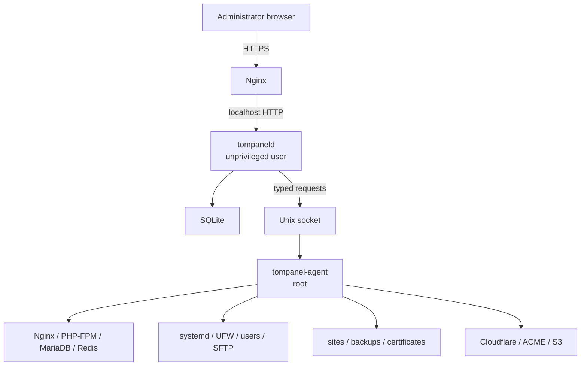

# TomPanel MVP Design Specification

**Status:** Approved for implementation planning
**Date:** 2026-08-08  
**License:** MIT  
**Target:** Ubuntu Server 24.04 LTS on AMD64

## 1. Summary

TomPanel is an open-source, single-server hosting control panel for one administrator. It manages multiple websites on one Linux VPS through simple guided flows while keeping the runtime lightweight and operational behavior predictable.

The MVP uses a native shared stack: Nginx, multiple PHP-FPM versions, MariaDB, optional Redis, OpenSSH/SFTP, and systemd. TomPanel itself is a Go modular monolith backed by SQLite. Its web process is unprivileged; a narrowly scoped root agent performs typed system operations over a protected Unix socket.

The MVP installs WordPress and Laravel, manages static/PHP/reverse-proxy sites, domains, SSL, databases, files, SFTP, caches, services, and backups. It deliberately excludes billing, resellers, mail hosting, containers, LiteSpeed, multi-server operation, and arbitrary web terminals or deployment scripts.

## 2. Product Goals

1. Make common hosting work follow a clear, reviewable flow.
2. Remain usable on a small VPS without Redis, containers, or a separate application database.
3. Keep existing sites available when a new operation or configuration change fails.
4. Prevent the web application from having unrestricted root access.
5. Make destructive actions recoverable where practical.
6. Keep public claims truthful: native site separation is not container-grade isolation, and local backups are not disaster recovery.

## 3. Non-Goals

- Multiple administrators, customers, roles, resellers, or billing
- Email mailbox hosting
- FTP or FTPS; the product supports SFTP only
- Docker or container-per-site deployment
- Apache, LiteSpeed, or OpenLiteSpeed
- Debian, Raspberry Pi OS, ARM64 releases, or multi-server clusters
- Full DNS-zone administration
- A public plugin SDK or stable public API
- Browser shell access or arbitrary root/systemd commands
- Arbitrary Laravel deployment hooks
- Node.js or Go application-process management for reverse-proxy sites
- Site cloning, staging environments, high availability, or long-term observability

## 4. Supported Environment

| Item | MVP decision |
|---|---|
| Operating system | Fresh Ubuntu Server 24.04 LTS |
| Architecture | AMD64 |
| Minimum capacity | 2 vCPU, 2 GB RAM, 20 GB free disk |
| Swap | Create 2 GB when no swap exists |
| Installation state | No existing web server, PHP, database server, or control panel |
| Network | Public IPv4 required for public sites; IPv6 is optional |
| Firewall | UFW, with TomPanel owning only rules it creates |

The installer stops and reports conflicts rather than altering an existing stack. It allows OpenSSH before enabling UFW so it cannot lock the administrator out.

## 5. Technical Stack

| Layer | Choice |
|---|---|
| Application language | Go 1.26.x |
| HTTP and UI | `net/http`, `html/template`, embedded assets, vanilla CSS/JavaScript |
| Live updates | Server-Sent Events |
| Panel database | SQLite through `modernc.org/sqlite` |
| Password hashing | Argon2id through `golang.org/x/crypto/argon2` |
| File confinement | Go `os.Root`, plus site-root ownership and mount restrictions |
| Web server | Nginx |
| PHP | PHP-FPM 8.3, 8.4, and 8.5; default 8.4 |
| PHP packages | Ondrej Sury PHP PPA, added with explicit installer consent |
| Site database | MariaDB 10.11, bound locally |
| Cache | Redis, installed only when selected |
| Process management | systemd |
| File transfer | OpenSSH `internal-sftp` with chroot |
| ACME | `go-acme/lego`, HTTP-01 and Cloudflare DNS-01 |
| Backup encryption | `filippo.io/age` |
| S3-compatible storage | AWS SDK for Go v2 |
| WordPress tooling | Signed WP-CLI Phar |
| Laravel tooling | Composer 2, Git, and optional Node.js 24 LTS |
| Distribution | Signed Debian package and small installer script |

Dependencies are pinned. Downloaded tools and archives must pass their upstream signature or checksum verification before activation.

## 6. System Architecture

### 6.1 `tompaneld`

- Runs as the dedicated `tompanel` user.
- Serves HTML, internal JSON endpoints, and SSE job streams.
- Owns product validation, authorization, state transitions, and audit events.
- Does not run arbitrary commands or write system configuration directly.
- Listens only on localhost; Nginx handles external TLS and routing.

### 6.2 `tompanel-agent`

- Runs as root under a hardened systemd unit.
- Listens on `/run/tompanel/agent.sock`, owned by `root:tompanel` with mode `0660`.
- Verifies the peer UID before accepting a request.
- Exposes typed operations, not a shell-command endpoint.
- Uses argument arrays and bounded input; it never interpolates untrusted shell text.
- Serializes package-manager changes and locks mutations for the same site or service.

### 6.3 CLI

The `tompanel` CLI handles installation diagnostics, status, updates, and offline account recovery. Account-reset commands use interactive prompts and never accept secrets in command-line arguments.

## 7. Filesystem and Service Layout

| Path | Purpose |
|---|---|
| `/usr/bin/tompanel` | Administrator CLI |
| `/usr/lib/tompanel/tompaneld` | Web daemon |
| `/usr/lib/tompanel/tompanel-agent` | Root agent |
| `/etc/tompanel/config.toml` | Non-secret product configuration |
| `/etc/tompanel/master.key` | Field-encryption key, owned by `tompanel:tompanel`, mode `0400` |
| `/var/lib/tompanel/tompanel.db` | SQLite database |
| `/var/backups/tompanel/` | Local backups |
| `/run/tompanel/agent.sock` | Privileged control socket |
| `/srv/tompanel/sites/<site-id>/` | Root-owned SFTP chroot and site data |
| `/etc/nginx/sites-available/tompanel-<site-id>.conf` | Generated Nginx site config |
| `/etc/systemd/system/tompanel-site-*.service` | Managed site workers |

Each site root is owned by root and is not writable by its site user, as required for SFTP chroot. Writable application, shared-data, and release directories live underneath it. Site accounts have no interactive shell. The `tompanel` user receives explicit ACL access for File Manager operations without being granted root access.

## 8. Data Model

SQLite uses WAL mode, foreign keys, a busy timeout, and durable synchronous writes. Schema changes are forward migrations wrapped in transactions. Updates take a database snapshot before applying migrations.

| Entity | Responsibility |
|---|---|
| `admins` | Single administrator identity, password hash, TOTP state |
| `sessions` | Hashed server-side session identifiers and expiry |
| `sites` | Type, status, filesystem identity, runtime selection |
| `domains` | Primary, subdomain, alias/parked, and redirect records |
| `php_runtimes` | Installed PHP versions and package state |
| `site_php_config` | Per-site FPM settings and requested extensions |
| `databases` / `database_users` | Site-owned MariaDB resources |
| `sftp_accounts` | Site account state and SSH-key metadata |
| `app_installations` | WordPress/Laravel version and deployment state |
| `certificates` | ACME identifiers, renewal state, and certificate paths |
| `dns_records` | Provider record IDs and TomPanel ownership metadata |
| `integrations` | Encrypted Cloudflare, S3/R2, and SMTP settings |
| `jobs` / `job_steps` | Durable workflow state, attempts, and redacted logs |
| `managed_resources` | Files, packages, rules, users, and services TomPanel owns |
| `backups` | Manifest, checksum, encryption, location, and retention state |
| `audit_events` | Security and configuration change history |
| `settings` | Server-wide non-secret product settings |

Secrets are encrypted per field with authenticated encryption using a master key stored separately from SQLite. Secrets are never written to job or audit logs.

## 9. Authentication and Panel Access

### 9.1 Initial bootstrap

1. Installer starts TomPanel in private mode.
2. It displays a cryptographically random, single-use setup URL valid for 15 minutes.
3. The URL is reachable only through localhost/SSH tunneling.
4. The administrator chooses a username and password, enrolls TOTP, and saves ten recovery codes.
5. The setup token is invalidated immediately.

### 9.2 Login security

- Passwords allow Unicode and spaces, are 12-128 characters, and have no composition rule.
- Common passwords and passwords containing the username are rejected.
- Passwords use Argon2id with a random salt and parameters suitable for a 2 GB server.
- Login errors do not reveal whether the username exists.
- IP and account throttles use bounded exponential delays rather than permanent lockout.
- TOTP accepts only a narrow clock-skew window.
- Session IDs are random, stored hashed, and delivered in `Secure`, `HttpOnly`, `SameSite=Strict`, host-only cookies.
- All state changes use CSRF tokens and origin checks.
- Idle timeout is 30 minutes; absolute lifetime is 12 hours.
- Step-up password and TOTP verification is valid for five minutes for sensitive work.

Username changes, password changes or recovery, and TOTP reset are intentionally unavailable in the Panel. They require an interactive `sudo tompanel admin ...` command on the VPS. A credential reset invalidates every session and recovery code.

### 9.3 Endpoint modes

- **Private default:** loopback HTTPS through an SSH tunnel, using a locally generated certificate.
- **Public:** Nginx HTTPS on a dedicated hostname and configurable port.
- A primary hostname is allowed only when reserved exclusively for TomPanel. It cannot also serve an administrator-managed site because browser cookies are not isolated by port.
- Cloudflare-proxied endpoints are limited to HTTPS ports 443 and 8443. Other custom ports require DNS Only.
- Endpoint changes require step-up authentication, DNS/port/firewall validation, certificate issuance, and a successful health check before the old endpoint is removed.

## 10. Site Model

Supported site types:

1. Static HTML
2. PHP
3. WordPress
4. Laravel
5. Reverse Proxy

Every site has an opaque ID, a display name, a primary domain, a Linux user, and a managed-resource ledger. PHP sites additionally have a selected PHP version, FPM pool, Unix socket, and per-site settings.

Native Linux separation reduces accidental cross-site access but is not presented as container-grade isolation. Disk quotas and per-site CPU quotas are not needed for the single-administrator MVP.

### Reverse Proxy boundary

TomPanel configures Nginx routing, TLS, WebSocket forwarding, timeouts, and health checks to a loopback port or Unix socket. It does not install, deploy, start, or stop the target Node.js/Go process.

## 11. Job and Configuration Model

Jobs transition through `queued`, `running`, `succeeded`, `failed`, `cancelling`, and `cancelled`. Cancellation occurs only between safe steps. Each step records its inputs, attempt count, result, owned resources, and redacted output.

Configuration changes use this sequence:

1. Validate product input.
2. Render to a temporary file.
3. Run the native validator, such as `nginx -t` or `systemd-analyze verify`.
4. Back up the active managed file.
5. Atomically replace the file.
6. Reload the service.
7. Run a health check.
8. Restore the prior file if activation fails.

Retry resumes from the first incomplete idempotent step. Cleanup removes only resources recorded as created by that job. Existing or externally managed resources are never inferred as disposable.

## 12. Site Provisioning Flow

1. Select Static, PHP, WordPress, Laravel, or Reverse Proxy.
2. Enter domain/subdomain and type-specific settings.
3. Select PHP version and bounded PHP settings when applicable.
4. Create MariaDB resources when applicable.
5. Select application source and optional add-ons.
6. Configure DNS manually or through Cloudflare.
7. Review generated resources and security implications.
8. Provision the site and stream job progress.
9. Verify HTTP locally, then issue SSL after public DNS is ready.
10. Activate HTTPS and mark the site `active`.

Site states are `provisioning`, `active`, `failed`, `disabled`, `deleting`, and `quarantined`.

## 13. Domains, DNS, and SSL

### Domains

- One primary domain per site
- Multiple subdomains
- Parked/alias domains sharing the site content
- 301 and 302 redirects
- Optional `www` canonical redirect
- Domain and port collision detection across all sites and Panel endpoints

### DNS

Manual mode shows the exact A, AAAA, or CNAME record and continuously checks propagation. Cloudflare mode uses a zone-scoped API token with DNS Read and DNS Write only.

TomPanel stores the Cloudflare record ID and adds an ownership comment/tag. It updates or deletes only those records. It never acts as a general zone editor.

### SSL

- HTTP-01 is the default for normal public hostnames.
- Cloudflare DNS-01 is used for wildcard certificates.
- Certificates include the exact active hostnames for a site.
- Renewal runs automatically with jitter, bounded backoff, and provider `Retry-After` handling.
- Nginx is validated and health-checked before HTTPS activation.
- Renewal failure appears on the Dashboard and never deletes the last valid certificate.

## 14. PHP, MariaDB, and Cache

### PHP

- Supported versions: 8.3, 8.4, and 8.5.
- Default for new WordPress and Laravel sites: 8.4.
- Each site has its own FPM pool, user, socket, and bounded `php.ini` overrides.
- Safe settings include memory limit, upload size, post size, execution time, input limits, and error-display policy.
- Extension packages are installed per PHP version and are therefore shared by every site on that version. The UI states this before installation.
- PPA packages are not silently added to Ubuntu unattended-upgrades. TomPanel detects updates and requires administrator confirmation.
- End-of-support PHP versions are blocked for new sites and produce migration warnings for existing sites.

### MariaDB

- One local MariaDB service, not publicly bound.
- Each site can own multiple databases and users.
- Grants are limited to selected site databases.
- The root agent uses local Unix-socket administration; no MariaDB root password is stored.
- Site credentials are encrypted, shown once when created or rotated after step-up authentication, and cannot be retrieved later.

### Cache

- Laravel clear-cache runs the fixed `artisan optimize:clear` operation.
- WordPress page cache has a site-specific cache directory.
- Optional Redis uses per-site credentials/ACL and key prefixes.
- TomPanel never issues Redis `FLUSHALL`.
- Per-site PHP OPcache clearing is not promised when pools share a PHP-FPM master.

## 15. File Manager and SFTP

File Manager supports listing, upload, download, text editing, create, rename, copy, move, archive, and extract. Deletes go to a site Trash area and expire according to retention.

All paths are relative to a pre-opened site root. Absolute paths, parent traversal, magic links, device files, and symlink escapes are rejected. Archive extraction validates every entry before writing and enforces file-count and expanded-size limits to prevent archive bombs.

SFTP accounts are site-scoped, forced to `internal-sftp`, chrooted, and denied shell, forwarding, tunneling, and agent access. Password and SSH-key authentication are supported. Password changes and key removal are audited.

## 16. Database Management and phpMyAdmin

The Database UI creates, deletes, backs up, restores, and rotates credentials for site-scoped MariaDB databases/users.

phpMyAdmin is downloaded once from the upstream stable release, verified by PGP/SHA256, and updated by an explicit TomPanel job. A site can enable one of these modes:

- **Private:** loopback port through SSH tunnel
- **Public subdomain:** dedicated HTTPS hostname
- **Public port:** HTTPS hostname and validated custom port

Public mode adds Nginx rate limits and an independent HTTP Basic Auth gate before the phpMyAdmin database login. Private mode remains the recommended default. Disabling the endpoint removes only its TomPanel-owned Nginx and UFW resources.

## 17. Application Installers

### WordPress

- Download and manage WordPress through a GPG-verified WP-CLI release.
- Configure locale, title, administrator, database, HTTPS, and secure salts.
- Secrets are passed over stdin or protected files, never command arguments or logs.
- Core security/minor updates are enabled by default.
- Major core, plugin, and theme auto-updates are independent opt-ins.
- System cron replaces request-driven WP-Cron when selected.
- Nginx page cache and Redis Object Cache are optional and independently removable.
- Cache clear affects only the selected site.
- LiteSpeed is not offered.

### Laravel

- Each TomPanel release pins and tests one supported Laravel major for fresh installs; recipe updates are explicit rather than dynamically selecting the newest release.
- Git deployment supports HTTPS and SSH repositories; private repositories receive a unique deploy key.
- Unsafe Git transports such as local-file and external helpers are disabled.
- Fixed production pipeline: checkout, Composer install without dev dependencies, optional Node build, optional confirmed migration, Laravel optimization, health check, and atomic symlink activation.
- Node builds support Node.js 24 LTS, npm, a committed `package-lock.json`, `npm ci`, and `npm run build` only.
- Queue workers and the scheduler run as the site user under TomPanel-managed systemd units.
- `.env`, deploy keys, and shared writable storage persist outside release directories.
- Failed deployments leave the current release active.

No arbitrary deployment commands or custom shell hooks are accepted in the MVP.

## 18. Backup and Restore

### Backup policy

- Automatic local backup once per day with randomized scheduling.
- Keep seven automatic backups per site.
- Manual backups are retained until removed or a configured storage guard requires action.
- Stop new backups and alert when disk usage reaches 85% or free space falls below 2 GB.
- MariaDB dumps use a transactionally consistent dump mode.
- Scheduled file archives are best-effort and labeled as such in their manifest.
- Manual backup can use application maintenance mode for stronger file/database consistency.

Each backup contains a versioned manifest, site metadata, file archive, database dump, checksums, tool versions, and consistency flags.

### Off-site storage

S3-compatible backup is optional. Backups are streamed through age encryption before upload. A dedicated recovery identity remains protected on the VPS for scheduled restores, and the administrator receives a one-time offline copy for disaster recovery.

### Restore

1. Download and verify the object and manifest.
2. Decrypt when needed.
3. Create a pre-restore backup.
4. Put the application into maintenance mode.
5. Restore to temporary files and a temporary database where practical.
6. Validate permissions, configuration, and application health.
7. Atomically activate restored data.
8. Roll back to the pre-restore state on failure.

Local backup alone is explicitly labeled as insufficient for VPS-loss recovery.

## 19. Dashboard, Services, and Logs

### Dashboard

- CPU, memory, load, swap, disk, and uptime
- Nginx, PHP-FPM, MariaDB, Redis, TomPanel, and worker status
- Active/failed sites and jobs
- SSL expiry and renewal failures
- Last successful backup and failed backup alerts
- Security updates and reboot-required state
- Quick actions for site creation, backup, and service inspection

The MVP reads current Linux metrics and does not store long-term time-series data.

### Services

TomPanel can view logs and start, stop, or restart only services it manages. It shows impacted sites and requires step-up authentication for disruptive actions. It does not expose arbitrary systemd units.

### Retention

| Data | Retention |
|---|---|
| Nginx access/error logs | 14 days, compressed |
| Job logs | 30 days |
| Audit events | 180 days |

Retention jobs pause before disk exhaustion and record their own failures without recursively flooding logs.

## 20. Updates and Package Management

Ubuntu official security updates run daily through `unattended-upgrades`; automatic reboot is disabled. The Dashboard reports when a reboot is required. General package upgrades, PPA updates, and phpMyAdmin/WP-CLI updates require administrator confirmation.

TomPanel checks a signed stable release manifest but does not self-update unattended. An update:

1. Pauses new mutable jobs.
2. Downloads the package and verifies SHA-256 plus Ed25519 signature.
3. Backs up SQLite, config, and the current binaries.
4. Applies the package and database migrations.
5. Restarts and runs local health checks.
6. Restores the prior database/config/binaries if the health check fails.

Distribution upgrades are not supported in the MVP.

## 21. Deletion and Recovery

Deleting a site requires typing its name and passing TOTP step-up. TomPanel then:

1. Creates a final backup.
2. Disables Nginx and managed workers.
3. Offers to remove TomPanel-owned Cloudflare records.
4. Moves files and database metadata into a seven-day quarantine state.
5. Allows restoration during quarantine.
6. Purges the Linux user, files, databases, secrets, and remaining owned resources after retention.

TomPanel does not delete externally created DNS records, certificates, files, databases, users, firewall rules, or systemd units.

## 22. UI Information Architecture

| Main navigation | Contents |
|---|---|
| Dashboard | Server status, alerts, and quick actions |
| Sites | Site list and guided creation |
| Domains | Cross-site domain, DNS, redirect, and SSL status |
| Databases | MariaDB resources and phpMyAdmin endpoints |
| Backups | Schedules, local/S3 storage, retention, and restore |
| Services | Managed service status, logs, and actions |
| Activity | Jobs and audit events |
| System | Packages, updates, disk, firewall, and reboot status |
| Settings | Panel endpoint, Cloudflare, S3/R2, SMTP, and security |

Each site has Overview, Domains, Files, SFTP, PHP, Databases, Apps, SSL, Cache, Backups, and Logs tabs. The UI favors guided forms, review screens, progress views, and actionable error messages. Inactive or unavailable controls are not shown as working features.

The interface is responsive, keyboard operable, and targets WCAG 2.2 AA basics: visible focus, semantic controls, sufficient contrast, meaningful status text, and no color-only communication.

## 23. Error Handling

- User errors identify the field and safe correction.
- System failures provide a stable error code, failed step, and redacted diagnostic excerpt.
- External-provider errors retain provider request IDs but not credentials.
- Timeouts and retries are bounded and use exponential backoff with jitter.
- Non-idempotent steps require a state check before retry.
- The last valid Nginx config, certificate, active Laravel release, and TomPanel package remain recoverable.
- Dashboard reads remain available while mutable jobs are paused, unless the Panel itself is updating.

## 24. Testing and Acceptance

### Automated checks

- Go unit tests for validation, state transitions, encryption, and config rendering
- HTTP handler and CSRF/session tests through `httptest`
- Agent authorization, peer-credential, argument-boundary, and timeout tests
- File Manager traversal, symlink, device-file, and archive-bomb tests
- SQLite migration and crash-recovery tests
- Nginx/PHP/systemd config validation tests
- Minimal browser smoke tests for login, TOTP, site wizard, and destructive confirmations
- GitHub Actions integration tests on Ubuntu 24.04 with real Nginx, PHP-FPM, MariaDB, Redis, UFW, and systemd where supported
- Secret scanning and log-redaction regression tests

### MVP release gates

1. Install and uninstall cleanly on a fresh Ubuntu 24.04 VM.
2. Bootstrap Admin privately, then switch safely to a public endpoint.
3. Create and remove Static, PHP, Reverse Proxy, WordPress, and Laravel sites.
4. Prove that a bad generated config cannot replace the active Nginx config.
5. Prove per-site filesystem, PHP-FPM, SFTP, MariaDB, and Redis boundaries.
6. Complete local and encrypted S3/R2 backup/restore drills.
7. Renew HTTP-01 and Cloudflare DNS-01 test certificates.
8. Fail and resume provisioning and deployment jobs without duplicating resources.
9. Roll back a failed TomPanel update, including a database migration.
10. Confirm no secret appears in application, job, Nginx, systemd, or audit logs.
11. Confirm the web daemon never requires root and the agent rejects unauthorized peers/operations.

## 25. Risks and Mitigations

| Risk | Mitigation |
|---|---|
| PHP PPA is a third-party package source | Explicit consent, pinned supported OS, update alerts, integration tests, no silent PPA upgrades |
| Native separation is weaker than containers | Per-site users/pools/sockets/ACLs, no shell, local databases, truthful documentation |
| Public phpMyAdmin attracts attacks | Private default, double authentication, rate limits, TLS, quick disable, explicit warning |
| Local backup is lost with the VPS | Optional encrypted S3/R2 target and offline recovery identity |
| Root-agent vulnerability has high impact | Small typed API, peer UID check, strict validation, no shell endpoint, security tests |
| Package/security updates can restart services | Audit and alert restarts, no automatic reboot, manual PPA/general upgrades |
| SQLite schema update can block rollback | Pause jobs, snapshot database/config/binaries, restore together on failed health check |
| File archives can escape or exhaust disk | `os.Root`, entry validation, symlink rejection, expanded-size/file-count limits, disk guard |
| Same hostname on different ports shares browser cookies | Public Panel hostname must be reserved exclusively for TomPanel |

## 26. Deferred Roadmap

After the MVP is stable and measured:

- Ubuntu 26.04 support when required PHP packages and integration tests are ready
- Debian support
- ARM64 and Raspberry Pi OS TomPanel Lite
- Tailscale/VPN private access
- OpenLiteSpeed as a server-wide profile, not a per-site toggle
- Additional application recipes
- Additional DNS providers
- Staging/cloning, resource quotas, and longer-term metrics

These are not scaffolded in advance. MVP code should keep clear internal boundaries but introduce no plugin framework or unused abstractions for future work.

## 27. Remaining Deployment-Time Inputs

These are configuration inputs, not unresolved design decisions:

- Public TomPanel hostname and port
- Cloudflare zone-scoped token when that integration is enabled
- S3/R2 endpoint, bucket, region, and credentials when enabled
- External SMTP settings for notifications when enabled
- Offline location where the administrator stores backup recovery identity
- Offline Ed25519 release-signing key ownership and rotation procedure
